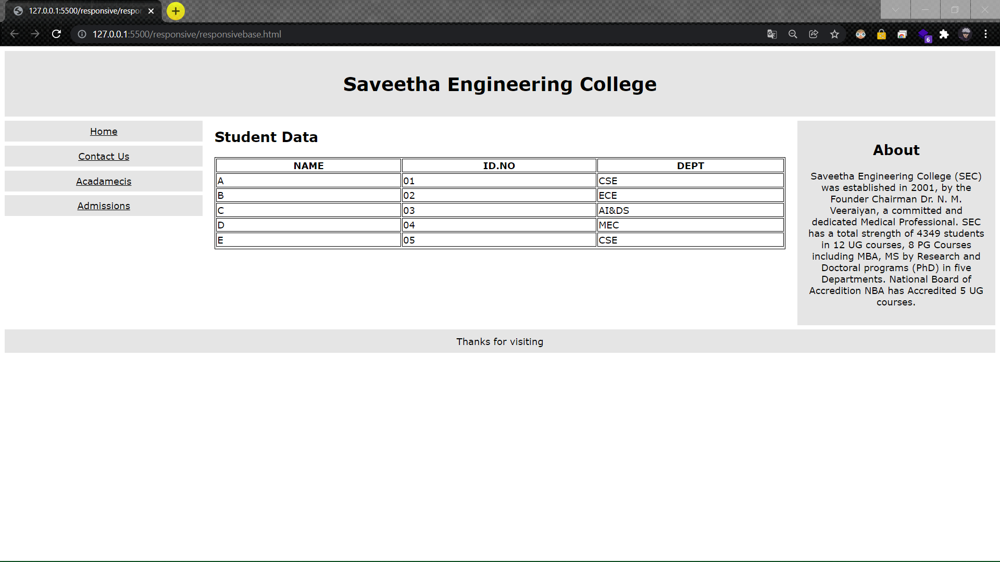
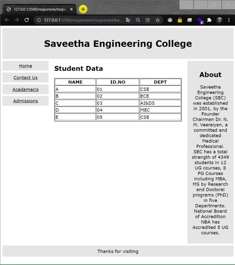
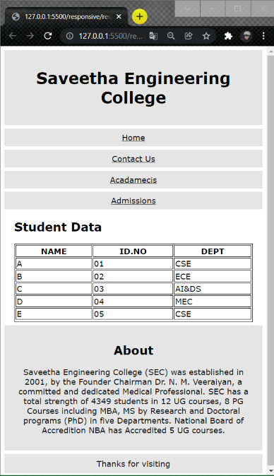

# Students-data

## AIM
develop a responsive website to display students data

# ALGORITHM
### STEP 1
create a simple html page using heading tag
### STEP 2
Add a table tags to display students data
### STEP 3
To make responsive use media attribute in css
### STEP 4
Execute the program

# CODE
~~~
<!DOCTYPE html>
<html>
<head>
<meta name="viewport" content="width=device-width, initial-scale=1.0">

</head>
<body style="font-family:Verdana;color:#aaaaaa;">

  <h1>Saveetha Engineering College</h1>

  

    <a href="#">Home</a>
    <a href="#">Contact Us</a>
    <a href="#">Acadamecis</a>
    <a href="#">Admissions</a>
  

  

    <h2>Student Data</h2>
    <table style="width:100%">
      <tr>
        <th>NAME</th>
        <th>ID.NO</th>
        <th>DEPT</th>
      </tr>
      <tr>
        <td>A</td>
        <td>01</td>
        <td>CSE</td>
      </tr>
      <tr>
        <td>B</td>
        <td>02</td>
        <td>ECE</td>
      </tr>
      <tr>
        <td>C</td>
        <td>03</td>
        <td>AI&DS</td>
      </tr>
      <tr>
        <td>D</td>
        <td>04</td>
        <td>MEC</td>
      </tr>
      <tr>
        <td>E</td>
        <td>05</td>
        <td>CSE</td>
      </tr>
      <tr>
    </table>
  

  

    <h2>About</h2>
    
Saveetha Engineering College (SEC) was established in 2001, by the Founder Chairman Dr. N. M. Veeraiyan, a committed and dedicated Medical Professional.
      SEC has a total strength of 4349 students in 12 UG courses, 8 PG Courses including MBA, MS by Research and Doctoral programs (PhD)  in five Departments.
      National Board of Accredition NBA has Accredited 5 UG courses.

  

Thanks for visiting

</body>
</html>
~~~
# OUPUT

# RESULT
responsive website to display students data was successfully executed.